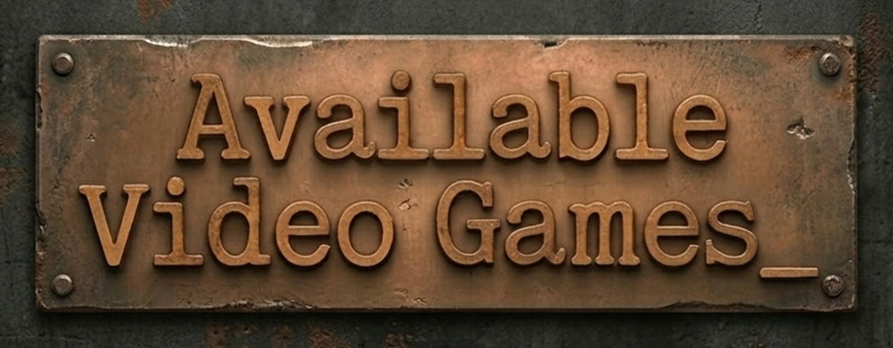

|  |
|:-----------------------------------------------------------------------:|

|  |
|:-----------------------------------------------------------------------:|

# Avoider Game (Revamped)

A rebuilt version of the original HTML5 avoider game.
Modular, cleaner, and designed to be easier to extend.

Built with **vanilla JS** and **Canvas**.
Runs directly in modern browsers (Chrome, Firefox, Edge) — no build step needed.

---

## Setup / How to Run
- Clone or download the repository
- Open the folder and launch `index.html`
- The game runs directly in the browser

---

## How to Play

| Action        | Input                        |
|---------------|------------------------------|
| Start Game    | Space Bar                    |
| Move Ship     | Mouse                        |
| Fire          | Mouse Button or Space Bar    |
| Fullscreen    | F                            |
| Restart       | Space Bar (after game over)  |

### Power-Ups

| Sprite     | Effect                                             |
|------------|----------------------------------------------------|
| Fire Orb   | Grants ammo — switches ship to SHOOT mode          |
| Ghost Orb  | Activates SHIELD — brief invincibility             |
| Ultra Orb  | Activates ULTRA — ship destroys enemies on contact |

---

## Player States

| State  | Description                                   | Visual Effect         |
|--------|-----------------------------------------------|-----------------------|
| AVOID  | Default — dodge enemies, no ammo              | Blue engine glow      |
| SHOOT  | Has ammo — can fire projectiles               | Orange/red fire glow  |
| SHIELD | Invincible for a short duration               | Blue-white aura       |
| ULTRA  | Destroys enemies on contact                   | Purple electric ring  |
| DEATH  | Player hit — triggers lose state              | Skull sprite          |

---

## Project Structure
```
Avoider-Game-HTML5-master/
│
├── index.html
├── README.md
│
├── css/
│   └── style.css
│
└── js/
    ├── Main.js
    │
    ├── classes/
    │   ├── AudioPlayer.js
    │   ├── BillBoard.js
    │   ├── Device.js
    │   ├── GameObject.js
    │   ├── KeyButtonManager.js
    │   ├── Layer.js
    │   ├── NPC.js
    │   ├── Player.js
    │   ├── Projectile.js
    │   └── Timer.js
    │
    ├── core/
    │   ├── Game.js
    │   ├── GameConsts.js
    │   ├── GameController.js
    │   └── UpdateGameStates.js
    │
    ├── render/
    │   ├── GameObjectsRenderLayer.js
    │   ├── HudRenderLayer.js
    │   ├── RenderBillBoardsLayer.js
    │   └── TextRenderLayer.js
    │
    ├── settings/
    │   ├── AssetTypes.js
    │   ├── Enums.js
    │   ├── KeysAndButtons.js
    │   └── Texts.js
    │
    ├── systems/
    │   ├── CollisionHandlers.js
    │   ├── NPCLogic.js
    │   └── ProjectileLogic.js
    │
    └── utils/
        ├── CollisionUtilities.js
        ├── DebugUtilities.js
        ├── FullScreenUtilities.js
        ├── PlayerEffects.js
        └── RenderUtilities.js
```

---

## Architecture Overview

- **classes/** — core game object definitions with private fields throughout
- **core/** — game loop, state machine, and constants
- **render/** — rendering passes for backgrounds, game objects, HUD, and text
- **settings/** — enums, asset definitions, key bindings, and UI text
- **systems/** — per-frame game logic for NPCs, projectiles, and collision response
- **utils/** — pure utility functions for collision math, rendering helpers, debug tools, and fullscreen

---

## Notable Features

- **Modular OOP** — private fields throughout, clear separation of concerns
- **Collision System** — broad-phase radius check before precise AABB test, safe reverse-loop removal
- **Audio Pooling** — `Sound` class with configurable pool size prevents dropped sounds on rapid playback
- **Parallax Background** — dual-copy scrolling with optional slow rotation and cosmic bloom effect
- **Player Effects** — per-state glow effects via radial gradients and `"lighter"` compositing
- **NPC Movement** — EYE moves straight down, BUG diagonal left, UFO diagonal right
- **Difficulty Scaling** — NPC speed and spawn rate increase over time driven by game clock
- **Timer System** — unified `Timer` class handles cooldowns, shield duration, and game clock with COUNTDOWN/COUNTUP modes
- **Fullscreen Support** — press F, scales canvas to fit any screen while preserving aspect ratio
- **Debug Tools** — toggleable hitbox rendering (H key) and debug panel (` key)
- **Fixed Timestep Loop** — 60fps accumulator pattern with `requestIdleCallback` for smooth startup
- **Defensive Coding** — try/catch throughout ensures errors never break the game loop

---

## Known Issues / Planned
- More enemy types and movement patterns planned
- Additional power-up types planned
- Difficulty curve and spawn rates may need tuning

---

## Notes
- Vanilla JS, no frameworks, no build step
- Runs directly in Chrome, Firefox, and Edge